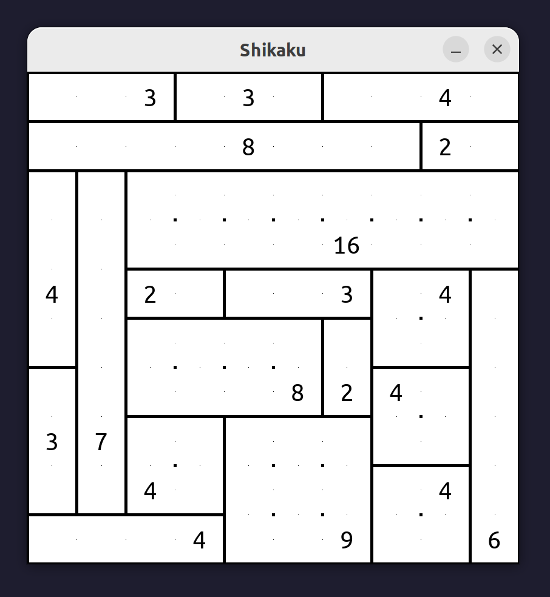

# Shikaku

A fun and challenging puzzle game. My implementation was inspired by [this](https://www.puzzle-shikaku.com/) website.

## Rules

You have to divide the grid into rectangular pieces such that each piece contains exactly one number, and that number is equal the area of the rectangle. ([Source](https://www.puzzle-shikaku.com/))

## Installation

You will need Python >= 3.10 and the `pygame` library. To install `pygame`, run
```
python -m pip install pygame
```

## Usage

To start the game, run `python shikaku.py`. Have fun!

## Example

This is what a solved game might look like:

<p align="center">
  <br>
  
</p>
